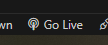
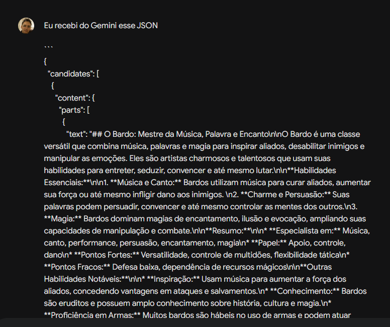
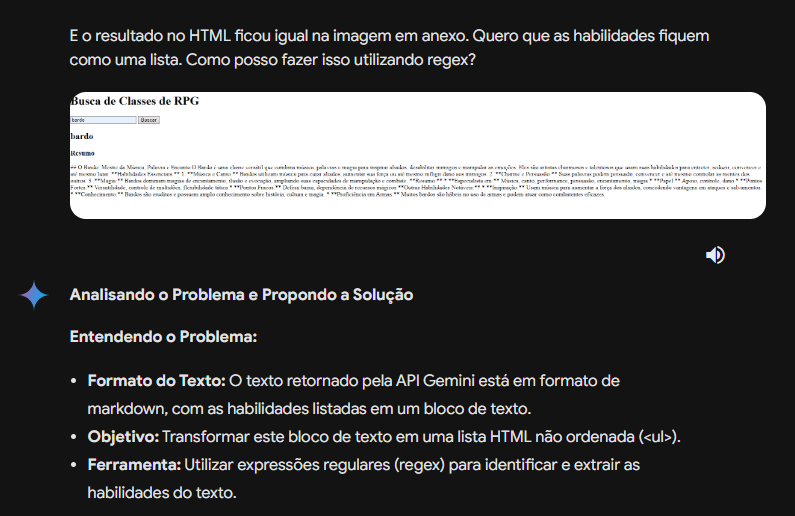
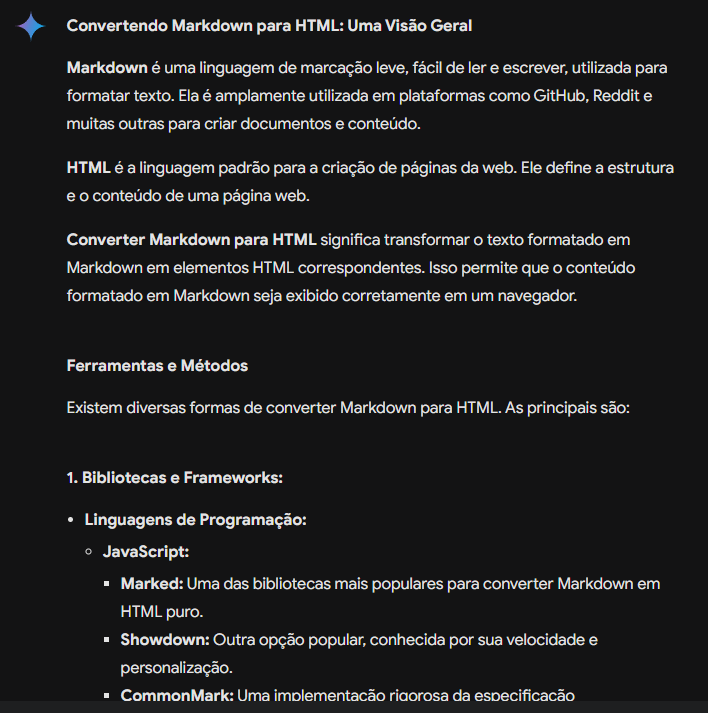
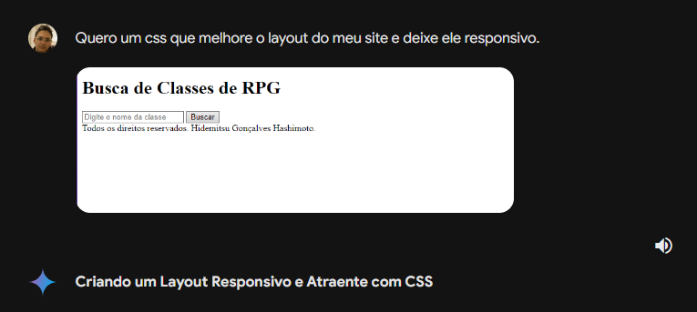
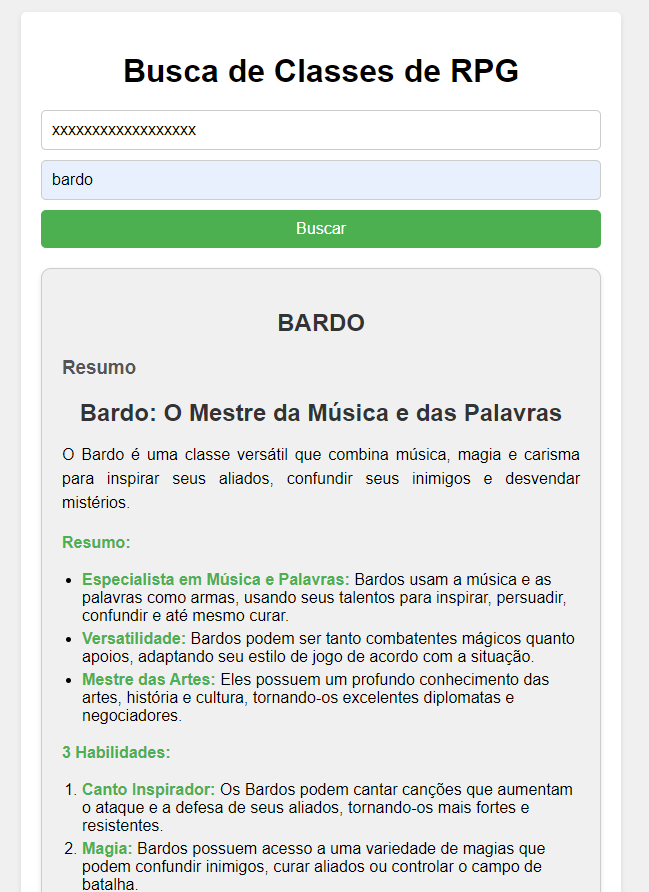

# alura-gemini-finance

## Descrição

O projeto tem como objetivo utilizar a API Gemini para gerar um resumo da classe informada bem como algumas habilidades da mesma.

## Como rodar o projeto localmente

Utilize a funcionalidade Go Live do próprio VSCode para rodar o projeto.

## Como utilizar

Para utilização do projeto será necessário adquirir uma chave API do Gemini. Segue o link para a documentação da API Gemini [API Gemini](https://ai.google.dev)

## Como foi o processo

Primeiramente informei ao Gemini a ideia principal e pedi para gerar um HTML e JS

Após ler a documentação da API Gemini e conseguir realizar requisição HTTP eu pedi para o Gemini analisar o JSON de resposta e me sugerir uma solução para melhorar o HTML

Então pedi para o Gemini sugestões para converter o Markdown para HTML

Após algumas tentativas frustradas tentando implementar a lógica manualmente decidi utilizar a "marked" uma das bibliotecas sugeridas pelo Gemini.

Depois de terminar a parte lógica eu pedi para o Gemini me sugerir o css da página.

E então após alguns ajustes manuais acredito que o projeto ficou satisfatório.

